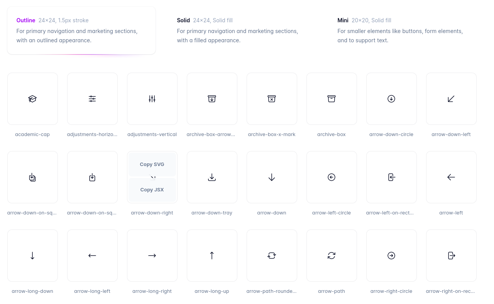

## Heroicons for Laravel Blade

**Update**. I wish I knew this earlier. [Blade UI Kit](https://blade-ui-kit.com/blade-icons) that does the same thing as this package, and more. Having said that, this package is no longer maintained.

Heroicons - beautiful hand-crafted SVG icons, by the makers of Tailwind CSS, available as Laravel Blade components: 



## Installation

Add the Composer package to your project using the following command:

```shell
composer require osmianski/laravel-heroicons
```

## Usage

Find an icon at [heroicons.com](https://heroicons.com) under Outline, Solid or Mini category and add it to your Laravel Blade template using the following syntax:

```html
<div class="text-gray-400 hover:text-gray-500">
    <x-heroicons::outline.bell class="h-6 w-6" />
    <x-heroicons::solid.user class="h-8 w-8" />
</div>
```  

Here, the first word after `::` is the category (`outline`, `solid` or `mini`), the second is the name of the icon.

For comparison, consider the "old" way - copying SVG from [heroicons.com](https://heroicons.com) into your code:

```html
<div class="text-gray-400 hover:text-gray-500">
    <svg xmlns="http://www.w3.org/2000/svg" fill="none" viewBox="0 0 24 24" stroke-width="1.5" stroke="currentColor" class="w-6 h-6">
        <path stroke-linecap="round" stroke-linejoin="round" d="M14.857 17.082a23.848 23.848 0 005.454-1.31A8.967 8.967 0 0118 9.75v-.7V9A6 6 0 006 9v.75a8.967 8.967 0 01-2.312 6.022c1.733.64 3.56 1.085 5.455 1.31m5.714 0a24.255 24.255 0 01-5.714 0m5.714 0a3 3 0 11-5.714 0" />
    </svg>
    <svg xmlns="http://www.w3.org/2000/svg" viewBox="0 0 24 24" fill="currentColor" class="w-8 h-8">
        <path fill-rule="evenodd" d="M7.5 6a4.5 4.5 0 119 0 4.5 4.5 0 01-9 0zM3.751 20.105a8.25 8.25 0 0116.498 0 .75.75 0 01-.437.695A18.683 18.683 0 0112 22.5c-2.786 0-5.433-.608-7.812-1.7a.75.75 0 01-.437-.695z" clip-rule="evenodd" />
    </svg>
</div>
```

Quite a difference, huh?

## Credits

All the Heroicons are originally created by [@tailwindlabs](https://github.com/tailwindlabs). They are later wrapped into Laravel Blade components by [@osmianski](https://github.com/osmianski).
   
## License

This package is open-sourced software licensed under the [MIT](LICENSE.md) license.
